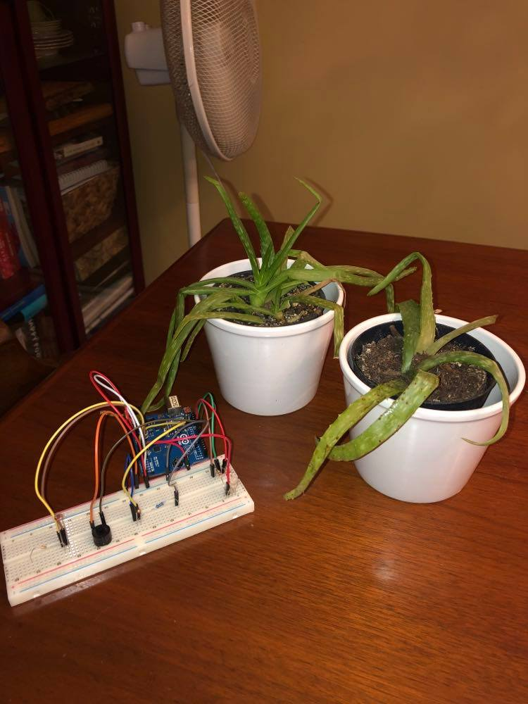

# Henry's Project
<!--
Welcome to your project page for Electronics for the Rest of Us. You'll use this page to describe and showcase your work throughout the module. 
A place for each deliverable has been created below for you in this markdown document. 
Note that comments (such as this) will not appear in the final markdown document (which you can view with the "Preview" button).
-->


## Day 1: Reflection
<!--
In this section, provide a ~250 word reflection on your first day of the module, and discuss why you're interested in this module and what you hope to take away from it.

You're also asked to insert a photo that represents your accomplishments on your first day. 
- Take a photo of you working or one of your circuits and upload it to the /docs/images/ folder of this repository. 
- Then, insert your photo into your document by modifying the markdown example that has been inserted below.
-->

<!--
Inserting an image takes the form: 

See the following webpage for more information: https://github.com/adam-p/markdown-here/wiki/Markdown-Cheatsheet#images
Replace the elements below to insert your picture.
--> 
**This is my day one reflection:
I have always been interested in coding and electronics, but have struggled to find the time to take courses during the regular university semester. When I discovered this course, I instantly knew that it would be my first choice module. After the first day, I am glad to say that I am very happy with the decision. In only a few short hours, we learnt how to create a webpage, using Github, and how to individualize our sites using markdowns. In terms of takeaways from the entire module, I am hoping to improve my overall knowledge regarding coding. Furthermore, I am hoping to gain a working understanding of the  arduino software system. I have seen first hand the massive range of possibilities that can be achieved using this software, and am excited to try it out myself! After using a number of open source softwares in the Drones and 3D mapping module, I am very excited to try out the arduino software and see what I can learn to create in the upcoming week. I anticipate that this week will be a difficult, but manageable workload due to the very clear and well formatted instructions posted on the worksheet pages.**


## Day 2: Results
<!--
Upload your fully-commented Arduino sketch from your final Day 2 build task--a thermometer connected to an RDB LED--into your GitHub repository.
Provide a short (~150 words) summary of your work on this circuit:

** 
- How does your device work?
- What was challenging? 
- What worked? What didn't? 
- Be sure to link to your code (in your GitHub repository) in the text of your response.
-->
[Thermometer Connected to an RBD LED](https://github.com/inspire-1a03/intersession-2020-hchallen/blob/master/docs/thermistor___RBG_v5.ino)

## Arduino build-off results
# Check out my code!
[Final Project Sketch](https://github.com/inspire-1a03/intersession-2020-hchallen/blob/master/docs/ex._17__final_may22.ino)

# Sample code
```
void loop()
{
 float temp;
  temp=Thermistor(analogRead(ThermistorPIN));       // read ADC and  convert it to Celsius
  Serial.print("Celsius: ");
  Serial.print(temp,1);                             // display Celsius
  //temp = (temp * 9.0)/ 5.0 + 32.0;                  // converts to  Fahrenheit
  //Serial.print(", Fahrenheit: ");
  //Serial.print(temp,1);                             // display  Fahrenheit
  Serial.println("");  
  
  // read the value from the sensor:
  sensorValue = analogRead(sensorPin);
  // print the value to the monitor
Serial.print("Light: ");
Serial.print(sensorValue,1); 
Serial.println("");  
```


<!--
Below is a general markdown table template. 
You can find more information at these links: 
- https://github.com/adam-p/markdown-here/wiki/Markdown-Cheatsheet#tables

-->

| Feature     |                                           Description                                                     |
|-------------|:---------------------------------------------------------------------------------------------------------:|
|Photoresistor|Allows the device to determine when the plants are not receiving enough light                              |
|RGB LED      |Gives the device the ability to visually communiate information using a colour coded system                |            |Thermometer  |Monitors termperatures in order to tell if it is too hot or too cold for the plants                        |     
|Buzzer       |Provides an audio commponent to the device to communicate the information that the device provides         |

**Arduino-Beeno3000: 
The Arduino-Beeno3000 is a cutting edge piece of agricultural technology. Using a Photoresisitor, a RGB LED, a buzzer and a thermometer the Arduino-Beeno3000 combines many of the basic arduino tools to create an effective and practical application. The device allows farmers, whether they be farming on a household or industrial scale, to carefully monitor key aspects that directly affect the health and safety of their plants. The Arduino-Beeno3000 comes fully equipped with temperature-measuring and light-monitoring technology. Due to the presence of a RGB ELD and a fully customizable buzzer, you will never miss a beat when it comes to the safety of your plants. Every farm in North America, big or small, can benefit from the Arduino-Beeno3000!**

# The Arduino-Beeno3000


<!--
Below is an example of embedding a YouTube video in a markdown document for use in GitHub pages. 
Note that this video won't show when previewing the document in GitHub--it only works on the GitHub pages webpage. 
- Once your YouTube video is uploaded, right click and select ```<> Copy embed code```. 
- You can paste this code directly into your markdown document. 
- Note that you may want to adjust the width and height parameters to make it fit well in your webpage
-->
# Shamless Plug...
<iframe width="560" height="315" src="https://www.youtube.com/embed/Kh423OQsQEM" frameborder="0" allow="accelerometer; autoplay; encrypted-media; gyroscope; picture-in-picture" allowfullscreen></iframe>

## Final reflection & summary
**Overall, I was thoroughly impressed with this module and what it had to offer in terms of both the declarative and procedural knowledge that I was able to quickly gain. As someone who has always been simultaneously intimidated and fascinated by coding, this course offered an excellent and well planned out first step into a world that can often seem exclusive and difficult to enter. 
Even though I am certain that the course would have been excellent in person, I really enjoyed the online lectures and the really well formatted website. I found myself being able to answer most, if not all, of the questions I had when working on the deliverables by simply looking at the website. 
There were many aspects of the course that I thoroughly enjoyed, but one that stood out in particular was the thermistor and RGD session. I found it very interesting and satisfying to see that ways in which the two separate devices could easily be combined using both their code and the physical arduino to make a new project. After experiencing that activity, it became clear that the arduino is a very unique and interesting device, with many real world applications. When I started trying to create my own arduino device, I was blown away by the community that exists online, and the thousands of people who are willing and eager to help each other problem solve and debug sketches. 
I am now in the process of buying my own arduino set. My mom has a lot of gardens on our property that provide a healthy supplement of fruits and vegetables during the summer. I believe that I will be able to use simple code and arduino materials to help automate many of the processes that we have to undertake on a daily basis to maintain the garden. I am planning on building an automated plant waterer using a soil moisture-tester and a water pump when the supplies arrive!**

