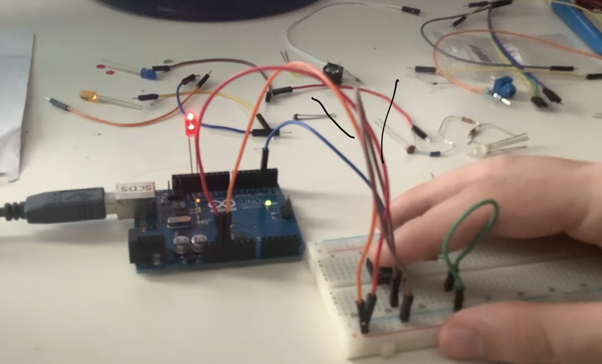

# Henry's Project
<!--
Welcome to your project page for Electronics for the Rest of Us. You'll use this page to describe and showcase your work throughout the module. 
A place for each deliverable has been created below for you in this markdown document. 
Note that comments (such as this) will not appear in the final markdown document (which you can view with the "Preview" button).
-->


## Day 1: Reflection
<!--
In this section, provide a ~250 word reflection on your first day of the module, and discuss why you're interested in this module and what you hope to take away from it.

You're also asked to insert a photo that represents your accomplishments on your first day. 
- Take a photo of you working or one of your circuits and upload it to the /docs/images/ folder of this repository. 
- Then, insert your photo into your document by modifying the markdown example that has been inserted below.
-->

<!--
Inserting an image takes the form: 

See the following webpage for more information: https://github.com/adam-p/markdown-here/wiki/Markdown-Cheatsheet#images
Replace the elements below to insert your picture.
--> 
**This is my day one reflection:
I have always been interested in coding and electronics, but have struggled to find the time to take courses during the regular university semester. When I discovered this course, I instantly knew that it would be my first choice module. After the first day, I am glad to say that I am very happy with the decision. In only a few short hours, we learnt how to create a webpage, using Github, and how to individualize our sites using markdowns. In terms of takeaways from the entire module, I am hoping to improve my overall knowledge regarding coding. Furthermore, I am hoping to gain a working understanding of the  arduino software system. I have seen first hand the massive range of possibilities that can be achieved using this software, and am excited to try it out myself! After using a number of open source softwares in the Drones and 3D mapping module, I am very excited to try out the arduino software and see what I can learn to create in the upcoming week. I anticipate that this week will be a difficult, but manageable workload due to the very clear and well formatted instructions posted on the worksheet pages.**



## Day 2: Results
<!--
Upload your fully-commented Arduino sketch from your final Day 2 build task--a thermometer connected to an RDB LED--into your GitHub repository.
Provide a short (~150 words) summary of your work on this circuit:

** 
- How does your device work?
- What was challenging? 
- What worked? What didn't? 
- Be sure to link to your code (in your GitHub repository) in the text of your response.
-->


## Arduino build-off results
<!--
Upload your fully-commented Arduino sketch from the final product of your Arduino build-off into the top-level of your module GitHub repository.


In ~300 words, provide a final device description and product pitch: 
- What does it do? Use a table (created in markdown) to list and describe the features. You can use the template provided below. 
- Describe briefly how it works.
- How could it be used in everyday life (or maybe just in rare cases)? 
- Be sure to link to your code (in your GitHub repository) in the text of your response.
- Include a snippet of code using the ``` ``` characters to display the code properly. 
Finally, record a short (30 second) video of a 'product pitch' for your device. 
- Upload the video to Youtube, and use the sample code below to embed your video.
-->


<!--
Below is a general markdown table template. 
You can find more information at these links: 
- https://github.com/adam-p/markdown-here/wiki/Markdown-Cheatsheet#tables

-->
| Feature | Description | Other Notes |
|---------|-------------|-------------|
|         |             |             |
|         |             |             |
|         |             |             |
|         |             |             |


<!--
Below is an example of embedding a YouTube video in a markdown document for use in GitHub pages. 
Note that this video won't show when previewing the document in GitHub--it only works on the GitHub pages webpage. 
- Once your YouTube video is uploaded, right click and select ```<> Copy embed code```. 
- You can paste this code directly into your markdown document. 
- Note that you may want to adjust the width and height parameters to make it fit well in your webpage
-->

<iframe width="789" height="444" src="https://www.youtube.com/embed/dQw4w9WgXcQ" frameborder="0" allow="accelerometer; autoplay; encrypted-media; gyroscope; picture-in-picture" allowfullscreen></iframe>


## Final reflection & summary
<!--
In ~300 words:
- Summarize your experience in this module. What you learned, what you liked, what you found challenging.
- Reflect upon your learning and its relevance in your life.
-->
